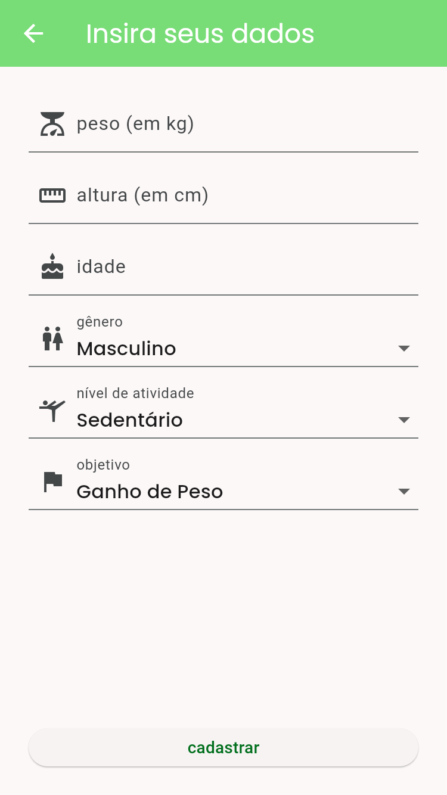
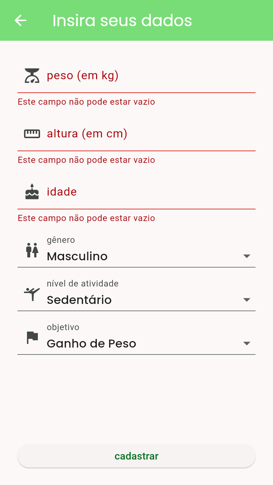
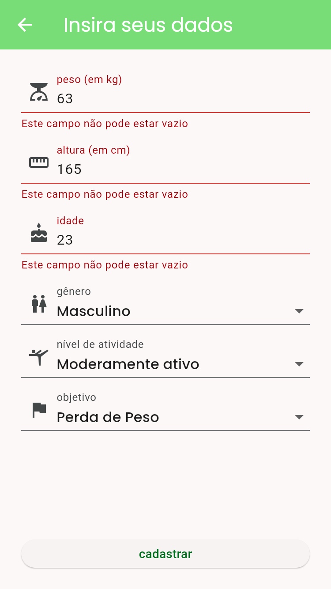
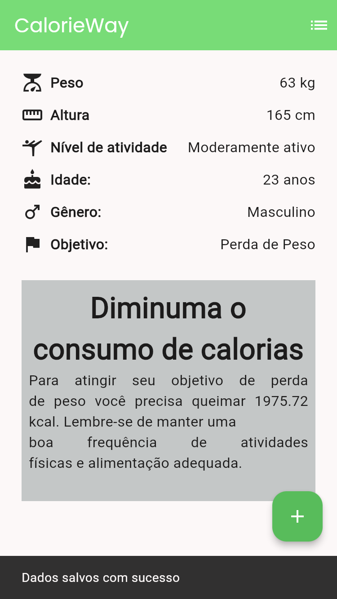
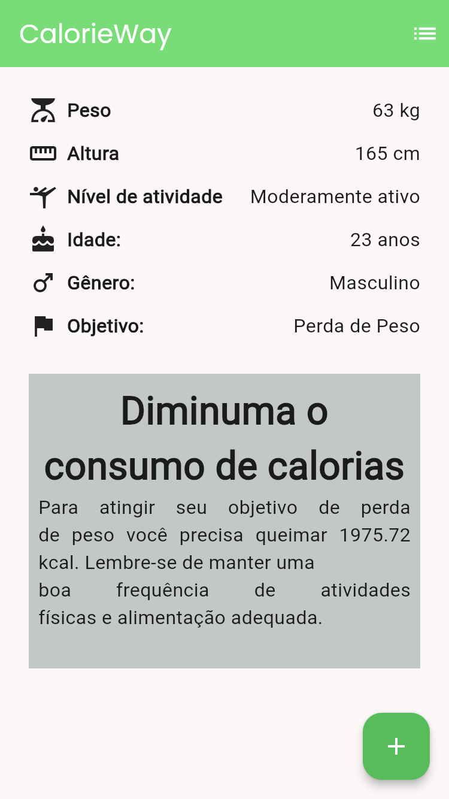

# CalorieWay

Um aplicativo Flutter para ajudar os usuários a calcular a ingestão diária recomendada de calorias com base no seu perfil físico e objetivos de peso.

## Funcionalidades

- Cálculo de calorias recomendadas para **perda** ou **ganho de peso**.  
- Entradas necessárias:
  - **Peso**, **altura**, **idade**, **gênero** e **nível de atividade física**.
- **Armazena localmente** o último cálculo realizado para fácil consulta.

## Primeiros Passos

Este projeto serve como ponto de partida para a construção do seu app de controle calórico com Flutter.

### Pré-requisitos

Certifique-se de ter os seguintes itens instalados:

- [Flutter SDK](https://docs.flutter.dev/get-started/install)  
- Android Studio ou Visual Studio Code (com os plugins Flutter/Dart)  
- Um dispositivo conectado ou emulador configurado  

### Instalação

1. Clone o repositório:  

    ```bash
    git clone git@github.com:tiagors09/calorie_way.git 
    ```

2. Acesse o diretório

    ```bash
    cd calorie_way
    ```

3. Instale as dependências:  

    ```bash
    flutter pub get
    ```  

4. Execute o aplicativo:  

    ```bash
    flutter run
    ```

### Screenshots












---

Desenvolvido com ❤️ por tiagors09 usando Flutter.
